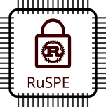
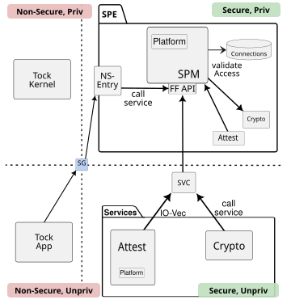

<!--
SPDX-FileCopyrightText: Infineon Technologies AG

SPDX-License-Identifier: MIT
-->

<div align="center">
  

  <h1>RuSPE</h1> 
  <span style="font-size: 18px;">
  Proof-of-concept Rust implementation of a Trusted Firmware-M (TF-M) / ARM Firmware Framework for M-Profile (FF-M)
  </span>
</div>

## Current Status
RuSPE is currently under active development. The current status of key features includes:
- **Initial Attestation**: PSA Token for Initial Attestion can be generated. 
- **Crypto Service**: Basic implementation for functions required by Initial Attestation.
- **Isolation-Models**: Similar to TF-M in the secure world the MPU can be optionally leveraged for isolated services.

Currently not implemented:
- No updatable bootloader supported yet

<div align="center">
  
</div>

## Prerequisites

To build and run this project, you will need the following tools installed:
- [Rust toolchain](https://rustup.rs/)
- `probe-rs` or ModusToolbox ProgTools OpenOCD (for flashing and debugging)
- Python 3.10+ (with the `uv` package manager)
- Go (optional, required only for the test client)

## Setup Workspace

First, set up the development environment using `uv` and `invoke`:

```bash
uv venv
uv sync # Install Python dependencies
source .venv/bin/activate # Activate the virtual environment
inv install # Install cargo tools
inv vscode # Generate VSCode configuration for development
```

## Usage on PSC3M5_EVK

The **PSC3M5_EVK** is a development board from Infineon featuring TrustZone-M. It is currently the primary supported board for this project.
To deploy and test RuSPE on this board, follow the steps below:

1. Provision the device with the protection context configuration:
  ```bash
  cd boards/psc3m5_evk/edgeprotecttools
  edgeprotecttools -t psoc_c3 init
  edgeprotecttools -t psoc_c3 provision-device -p ns_policy/policy_oem_provisioning.json
  ```

2. Build and flash the tock board image:
  ```bash
  cd boards/psc3m5_evk/secure
  inv flash --nspe=tock
  ```

3. Run tests against a flashed device using the client tester go application:
  ```bash
  cd tools/test-client
  go run . --token-src tty
  ```

## Acknowledgements

This project draws significant inspiration from [Trusted Firmware-M
(TF-M)](https://www.trustedfirmware.org/projects/tf-m/).  Several interfaces,
data structures, and architectural concepts in RuSPE (such as the PSA IPC mechanisms and
cryptography types) are modeled after or directly ported from the TF-M reference implementation. We
acknowledge and thank the Arm Limited team and TF-M contributors for their work.

## Disclaimer

This is a student research project done in cooperation with **Infineon Technologies AG**, and is **not intended for production use**.

The code is provided "as is" without any warranties. This is not an officially supported Infineon product.
